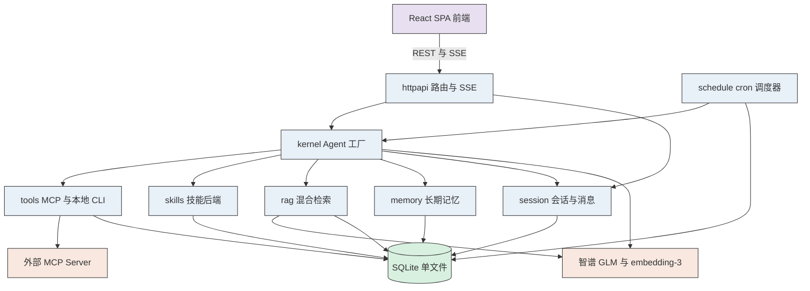
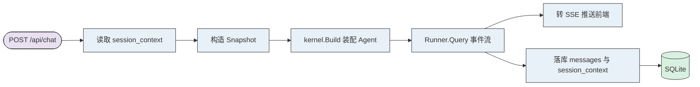
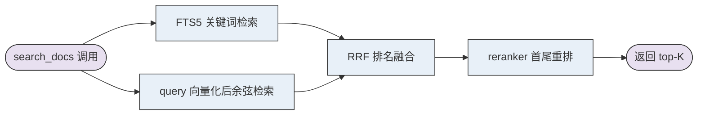

> Generated by [**TTADK**](https://bytedance.larkoffice.com/wiki/Gw0ewxEbHi1K0NkVd2YcNwvVnTg) (TikTok AI-Driven Development Kit) brainstorm command

## 涉及项目

| 服务 (PSM) | 项目路径 | 变更类型 |
| --- | --- | --- |
| 无（本地单机程序） | `cmd/agent/` | 新增 |
| 无（本地单机程序） | `internal/agent/` | 新增 |
| 无（本地单机程序） | `web/` | 新增 |
| 无（本地单机程序） | `go.mod` / `go.sum` | 修改（仅增加依赖） |

现有 `cmd/*`、`demo/*`、`internal/{llm,skill,mcpclient,gitmcp,agentio,democli}` 零改动。新 Agent 仅复用 `internal/llm` 与 `internal/mcpclient` 两个包，且以只读方式引用。

---

## 背景与目标

当前仓库是一组 Eino 学习 demo（3 次提交，2632 行 Go，全部为 CLI 示例，无数据库、无 HTTP 服务）。本方案要在其之上新建一个**可长期使用的通用 Agent**，具备：命令行入口、MCP 与本地 CLI 双通道工具调用、技能驱动、本地文档 RAG、短期与长期记忆、会话管理、定时任务，以及一个 Codex 风格的 Web 交互页面。

设计上的一条主线是：**通用性来自"换 MCP server、换技能、换文档"，而不是来自"让模型随便执行命令"**。

---

## 整体架构

单进程、单文件数据库。前端构建产物通过 `go:embed` 打进二进制，最终发布形态是一个可执行文件。

---

## 关键技术决策

| 决策项 | 选择 | 理由 |
| --- | --- | --- |
| Agent 生命周期 | 会话级工厂：每次对话按配置快照构造 | `ChatModelAgent` 构造时固定工具集，与"页面上热更新配置"直接冲突。快照法绕开全局单例热重建的并发竞态，并白送会话级差异化配置能力 |
| 框架利用策略 | 最大化使用 Eino 内置中间件 | `skill` / `reduction` / `summarization` / `filesystem` / `toolsearch` / `plantask` 六件套覆盖大半需求，自研量大幅下降 |
| 结构化存储 | SQLite 单文件（`modernc.org/sqlite`，纯 Go 无 CGO） | 零容器依赖，`go run` 即用，删文件即重置 |
| 向量存储 | 同一个 SQLite 存 BLOB，Go 内存暴力余弦 | 万级 chunk 内全量余弦在 10ms 量级。本地文档库远达不到需要向量数据库的规模，引入 Milvus 是过度设计 |
| 检索策略 | FTS5 关键词 + 向量，RRF 融合 | 余弦相似度与 BM25 量纲不同，加权相加无意义；RRF 只用排名，天然规避 |
| Embedding | 智谱 `embedding-3` | 复用现有 `ZHIPUAI_API_KEY` 与 OpenAI 兼容端点，零额外部署。代价是文档全文出本机 |
| 上下文治理 | fork 隔离 → reduction 卸载 → summarization 摘要 | 先源头隔离，再可逆卸载，最后才有损摘要。顺序不可颠倒 |
| 历史持久化 | `messages` 原始 + `session_context` 压缩视图 | 单一视图会导致"页面看不到历史"或"每次恢复重复压缩" |
| 本地 CLI 安全 | 声明式模板为主，`execute` 默认关闭 | 日常路径的命令是预先审过的，无需沙箱 |
| 长期记忆 | `remember` 工具 + `key` 覆盖去重 + 分档召回 | 小规模全量注入严格优于检索：零漏召回、零延迟、无"模型忘了调用"风险 |
| 定时任务上下文 | 默认无状态，可选保留上下文 | 定时任务的输出是报告不是对话，默认不污染会话列表 |
| 前端 | React + Vite + TS + Tailwind + shadcn/ui | 风格与 Codex 截图同源（Radix + Tailwind 一脉） |

### Eino 内置能力与自研边界

| 能力 | 来源 |
| --- | --- |
| 技能渐进披露、fork 子 agent 执行 | `eino/adk/middlewares/skill` |
| 工具结果卸载与历史清理 | `eino/adk/middlewares/reduction` |
| 对话历史自动摘要 | `eino/adk/middlewares/summarization` |
| `read_file` / `write_file` / `edit_file` / `glob` / `grep` / `execute` | `eino/adk/middlewares/filesystem` |
| 工具过多时的动态可见性 | `eino/adk/middlewares/dynamictool/toolsearch` |
| 任务清单工具 | `eino/adk/middlewares/plantask` |
| 文档解析 PDF / DOCX / HTML / XLSX | `eino-ext/components/document/parser/*` |
| 文档切分 markdown / recursive / semantic | `eino-ext/components/document/transformer/splitter/*` |
| 检索结果首尾重排 | `eino-ext/components/document/transformer/reranker/score` |
| Embedding | `eino-ext/components/embedding/openai` |
| **向量索引与检索** | **自研**（SQLite + FTS5 + 内存余弦） |
| **Session 管理与消息持久化** | **自研** |
| **长期记忆** | **自研**（Eino 无对应能力） |
| **`CheckPointStore` 实现** | **自研**（Eino 只定义接口，无任何实现） |
| **MCP 多 server 管理** | **自研**（现有 `mcpclient` 是单连接模型） |
| **cron 调度** | **自研**（`robfig/cron/v3`） |
| **HTTP / SSE 服务层与前端** | **自研** |

---

## 功能模块

### 模块 A：Agent 内核与入口

#### 功能概述

命令行启动，按配置快照装配 Agent 实例并驱动 ReAct 循环，把事件流转成 SSE 推给前端。

#### 代码变更

| 变更类型 | 文件 / 方法 | 说明 |
| --- | --- | --- |
| 新增 | `cmd/agent/main.go` | 入口。flag：`--addr`（默认 `127.0.0.1:8090`）、`--db`、`--rag-dir`、`--skills-dir` |
| 新增 | `internal/agent/kernel/snapshot.go#Snapshot` | 配置快照：模型、工具集、技能集、记忆、限额 |
| 新增 | `internal/agent/kernel/factory.go#Build` | 按快照组装 `ChatModelAgent` 与中间件栈 |
| 新增 | `internal/agent/kernel/context.go` | 配置并挂载 `reduction` 与 `summarization` |
| 新增 | `internal/agent/httpapi/stream.go` | `adk.AgentEvent` 转 SSE |
| 新增 | `internal/agent/config/config.go` | 配置加载与运行时变更 |

**只监听回环地址**，不提供 `0.0.0.0` 选项——该程序可读本地文件、执行命令、访问密钥，且无任何鉴权。

密钥仅从环境变量 `ZHIPUAI_API_KEY` 读取，不进数据库、不进配置文件、不作为 flag（`ps` 可见）。

#### 中间件挂载顺序

顺序不是任意的，`filesystem` 必须早于 `reduction`（卸载后要靠它取回），`reduction` 必须早于 `summarization`（先可逆后有损）。

#### SSE 事件类型

`message_delta`、`tool_call`、`tool_result`、`compression`、`error`、`done`。

流式模式下 `ToolCalls` 需等流收完才完整（现有 `internal/agentio` 已注明此约束），因此工具调用事件必须在流结束后补发，不能边收边发。

#### 调用链

---

### 模块 B：工具系统

#### 功能概述

统一管理两类工具来源：远程 MCP server 与本地 CLI 命令，装配时做命名冲突检测与按会话的范围过滤。

#### DB 变更

| 变更类型 | 表 / 字段 | 说明 |
| --- | --- | --- |
| 新建表 | `mcp_servers` | 端点、`secret_ref`（环境变量名，非明文）、启用状态、健康状态 |
| 新建表 | `cli_tools` | 声明式工具：名称、描述、命令、参数模板、超时、启用状态 |
| 新建表 | `cli_policy` | `execute` 工具的白名单 / 黑名单规则 |

#### 代码变更

| 变更类型 | 文件 / 方法 | 说明 |
| --- | --- | --- |
| 新增 | `internal/agent/tools/mcp/manager.go` | 多连接管理、懒连接、健康检查、连通性测试 |
| 新增 | `internal/agent/tools/cli/declarative.go` | 读 `cli_tools` 动态构造工具 |
| 新增 | `internal/agent/tools/cli/exec.go` | 执行、环境变量白名单、超时、输出截断 |
| 新增 | `internal/agent/tools/cli/shell.go` | `filesystem.Shell` 实现 + `CommandValidator` |
| 新增 | `internal/agent/tools/registry.go` | 装配、冲突检测、按会话过滤工具范围 |
| 复用 | `internal/mcpclient` | 不改动，作为底层连接层 |

#### 实现要点

**动态工具不能用 `utils.InferTool`。** 它依赖 Go 泛型在编译期推导 JSON Schema，而 CLI 工具是运行时在页面上定义的。正确走法是 `utils.NewTool[map[string]any, string](toolInfo, handler)` 配 `schema.NewParamsOneOfByParams` 手工构造参数描述。

**工具名冲突必须处理。** 两个 MCP server 都提供 `read_file` 会互相覆盖。统一加前缀 `<server>__<tool>`，装配时检测冲突并在页面标注。

**连接失败不阻塞启动。** 某个 MCP server 不可达时记录状态、页面标红，其余工具照常可用。

**子进程环境变量走白名单**（`PATH`、`HOME`、`LANG` 等）。Go 的 `exec.Cmd` 在 `Env` 为 nil 时继承父进程全部环境变量，显式列举反而更省事。参数一律以切片传给 `exec.CommandContext`，不拼接 shell 字符串。

**`execute` 工具默认关闭**，定时任务场景下强制禁用（无人可做确认）。

---

### 模块 C：Skills

#### 功能概述

技能以 `SKILL.md` 定义，两级渐进披露；支持 `inline` / `fork` / `fork_with_context` 三种执行模式；页面可增删改并即时生效。

#### DB 变更

| 变更类型 | 表 / 字段 | 说明 |
| --- | --- | --- |
| 新建表 | `skills` | 页面创建的技能：名称、描述、正文、执行模式、指定 agent 与 model |

#### 代码变更

| 变更类型 | 文件 / 方法 | 说明 |
| --- | --- | --- |
| 新增 | `internal/agent/skills/backend.go` | 实现 `skill.Backend` 的 `List` / `Get` |
| 新增 | `internal/agent/skills/store.go` | 技能 CRUD 与目录扫描缓存 |
| 废弃 | `internal/skill` | 保留供现有 demo 使用，新 Agent 不再引用 |

#### 实现要点

不使用现成的 `NewBackendFromFilesystem`，因为它只读单一目录。本方案需**合并两个来源**：`--skills-dir` 指向的文件系统目录（便于编辑器与 git 管理）与 SQLite 中页面创建的技能，同名时以数据库为准并标注冲突。

**热重载几乎零成本。** `Backend.List(ctx)` 是在 `skillTool.Info(ctx)` 中调用的，每次取工具描述都会重读；叠加会话级工厂每次重建 Agent，双重保险。`POST /api/skills/reload` 实际只需让目录扫描缓存失效。

注意 Eino 把技能清单渲染进 **`skill` 工具的 description**，而非 system prompt——清单与工具绑定，模型看到工具即看到清单。`Config.UseChinese` 置真以启用中文提示词。

---

### 模块 D：RAG

#### 功能概述

扫描本地目录与页面上传的文档，解析、切分、向量化后入库；检索时走 FTS5 关键词与向量双路，RRF 融合后重排；作为 `search_docs` 工具由模型按需调用。

#### DB 变更

| 变更类型 | 表 / 字段 | 说明 |
| --- | --- | --- |
| 新建表 | `rag_documents` | 路径、标题、hash、大小、索引时间、状态与失败原因 |
| 新建表 | `rag_chunks` | 切分片段：所属文档、序号、正文、token 数 |
| 新建表 | `rag_vectors` | 向量，`float32` 打包为 BLOB |
| 新建表 | `rag_chunks_fts` | **FTS5 虚拟表**，混合检索的关键词一侧 |

#### 代码变更

| 变更类型 | 文件 / 方法 | 说明 |
| --- | --- | --- |
| 新增 | `internal/agent/rag/loader.go` | 目录扫描与上传，按扩展名派发解析器 |
| 新增 | `internal/agent/rag/split.go` | Markdown 用 `splitter/markdown`，其余用 `recursive` |
| 新增 | `internal/agent/rag/embedder.go` | `embedding/openai` 指向智谱端点 |
| 新增 | `internal/agent/rag/indexer.go` | 实现 `indexer.Indexer`，写 chunks / vectors / FTS |
| 新增 | `internal/agent/rag/retriever.go` | 实现 `retriever.Retriever`，混合检索 |
| 新增 | `internal/agent/rag/tool.go` | 包装为 `search_docs` 工具 |
| 新增 | `internal/agent/rag/manager.go` | 文档增删、重建触发、进度跟踪 |

#### 实现要点

**增量索引是必需品而非优化。** `rag_documents` 存文件 hash，重新加载时只处理新增与变更文件。否则每次点"重新加载"都要全量重新向量化，既慢又消耗智谱配额。

**向量以 `float32` 打包为 BLOB**，不用 JSON。1024 维 float32 是 4KB，JSON 文本会膨胀三倍以上且每次检索都需反序列化。

**索引是长耗时操作**（几千 chunk 需数分钟），必须做成后台任务并上报进度，不能阻塞 HTTP 请求。

**失败原因必须在页面显示。** PDF 解析失败、文件过大、embedding 超限都会发生，静默跳过会让用户误以为索引成功但检索不到。

#### 检索调用链

`reranker/score` 并非简单按分数降序，而是把高分文档置于数组**首尾**、低分置于中间，针对 LLM 的 "lost in the middle" 效应——模型对上下文首尾的注意力显著高于中部。

---

### 模块 E：记忆

#### 功能概述

短期记忆由 Eino 中间件接管（工具结果卸载 + 历史摘要）；长期记忆自研，以 `key` 为主键的结构化事实，页面可见可编辑。

#### DB 变更

| 变更类型 | 表 / 字段 | 说明 |
| --- | --- | --- |
| 新建表 | `memories` | `key` 主键、正文、分类、来源 session、创建与更新时间 |

#### 代码变更

| 变更类型 | 文件 / 方法 | 说明 |
| --- | --- | --- |
| 新增 | `internal/agent/memory/store.go` | CRUD，同 `key` 覆盖 |
| 新增 | `internal/agent/memory/tool.go` | `remember(key, content, category)` 工具 |
| 新增 | `internal/agent/memory/inject.go` | 分档注入策略 |
| 新增 | `internal/agent/store/offload.go` | `reduction.Backend` 实现，卸载内容落盘 |

#### 实现要点

**`key` 是去重的关键。** 模型在长期使用中会反复记录同一件事的不同措辞，无 key 时记忆表将不断膨胀并互相矛盾。有 key 后"更新"与"新增"被自然区分，页面列表始终是一条条独立事实。

**召回分档：**

| 记忆规模 | 召回方式 | 是否提供 `recall` 工具 |
| --- | --- | --- |
| 小（约 50 条 / 2000 token 以内） | 全量注入 system prompt | 否 |
| 大 | 向量检索 top-K 注入 | 是 |

小规模全量注入**严格优于**检索：零漏召回、零额外延迟、且不存在"模型忘了调用 `recall`"这一失败模式。个人 Agent 绝大多数时候处于这一档。

**注入文案须带限定语**："以下是关于用户的已知事实，可能已过时，与当前对话冲突时以当前对话为准。" 否则模型会把数月前的旧偏好当作硬约束，与当下指令冲突。

**人工录入是地基，模型自动记忆是锦上添花。** `remember` 的调用时机完全由模型判断，不可靠；页面上手动新增记忆才是可靠路径。因此不做会话末自动抽取（多一次 LLM 调用换取有限收益）。

**`reduction` 的卸载目标用本地文件目录而非数据库**，以便模型通过 `filesystem` 中间件的 `read_file` 取回——这正是中间件顺序中 `filesystem` 必须早于 `reduction` 的原因。

阈值默认值（`glm-4.5-air` 上下文窗口 128K）：`reduction` 约 60K 触发，`summarization` 约 80K 触发，留足余量因 token 估算不精确。

---

### 模块 F：Session 管理

#### 功能概述

会话的增删改查、消息持久化与恢复，以及压缩状态跟踪。

#### DB 变更

| 变更类型 | 表 / 字段 | 说明 |
| --- | --- | --- |
| 新建表 | `sessions` | 标题、创建与更新时间、归档标记、token 占用、压缩次数 |
| 新建表 | `messages` | **原始完整消息**：role、content、`tool_calls`（JSON）、序号 |
| 新建表 | `session_context` | **压缩后的模型输入快照** |
| 新建表 | `checkpoints` | `CheckPointStore` 实现，支撑中断与恢复 |

#### 代码变更

| 变更类型 | 文件 / 方法 | 说明 |
| --- | --- | --- |
| 新增 | `internal/agent/session/session.go` | 新建、重命名、归档、删除 |
| 新增 | `internal/agent/session/title.go` | 标题异步生成 |
| 新增 | `internal/agent/session/messages.go` | 消息读写，`tool_calls` 序列化 |
| 新增 | `internal/agent/session/context.go` | 模型输入视图的快照与恢复 |
| 新增 | `internal/agent/store/checkpoint.go` | `CheckPointStore` 的 SQLite 实现 |

#### 实现要点

**双视图持久化是本模块最关键的决策。** `summarization` 压缩后历史消息被摘要替换，若只存一份：

- 只存压缩后 → 用户在页面上看不到自己此前说过什么
- 只存原始 → 每次恢复会话都要重新压缩，浪费且两次摘要结果不一致

因此 `messages` 存原始完整消息（供展示、导出、审计），`session_context` 存压缩后的模型输入快照（供恢复对话）。两者是同一段对话的两个视角，缺一不可。

**`tool_calls` 的 ID 必须原值保留。** 修改 ID 会让 assistant 消息中的工具调用与后续 tool 消息对不上，导致模型困惑甚至报错。

**`CheckPointStore` 与 session 持久化是两回事：**

| | 解决什么 | 生命周期 |
| --- | --- | --- |
| session 持久化 | 跨进程重启的对话历史 | 长期 |
| `CheckPointStore` | 单次 run 中途被打断后继续 | 临时，用完即删 |

**标题异步生成。** 截取首条用户消息常常很难看（用户第一句可能是"在吗"）。方案为：对话正常进行，后台单独调一次模型生成短标题，完成后推给前端更新，用户无感知延迟。

---

### 模块 G：定时任务

#### 功能概述

进程内 cron 调度，任务可由用户在页面配置，也可由 Agent 在对话中通过工具自行登记；到点以受限工具集执行，结果落任务历史。

#### DB 变更

| 变更类型 | 表 / 字段 | 说明 |
| --- | --- | --- |
| 新建表 | `scheduled_tasks` | 名称、cron、提示词、是否启用、是否保留上下文、绑定 session、工具范围、上次与下次执行时间 |
| 新建表 | `task_runs` | 开始与结束时间、状态（成功/失败/跳过/missed）、结果正文、错误信息 |

#### 代码变更

| 变更类型 | 文件 / 方法 | 说明 |
| --- | --- | --- |
| 新增 | `internal/agent/schedule/scheduler.go` | cron 调度（`robfig/cron/v3`），启动时全量恢复 |
| 新增 | `internal/agent/schedule/store.go` | 任务与执行记录读写 |
| 新增 | `internal/agent/schedule/tool.go` | `schedule_task` 工具 |
| 新增 | `internal/agent/schedule/runner.go` | 构造受限 Snapshot、执行、结果落库 |

#### 实现要点

**数据库是唯一真相源，内存调度器只是其运行时投影。** 增删改一律"先写库、再同步调度器"，进程崩溃或 `kill -9` 后从 `scheduled_tasks` 全量恢复即可。内存中需维护 `任务 ID → cron EntryID` 映射，因为 `robfig/cron` 用自己的 `EntryID` 标识调度项。

**错过不补跑。** 启动时对 `next_run_at` 已过期的任务写一条 `missed` 记录并重算下次时间。记录这一事实很重要——否则用户会以为任务在跑，实际上它上周就因关机而静默失效。

**同一任务禁止重叠执行。** Agent 任务动辄数十秒至数分钟，一个每分钟触发的任务能在十分钟内堆起十个并发实例。上次未完成则跳过并记录。

**`schedule_task` 必须回显下次执行时间。** 模型书写 cron 表达式出错率不低（`0 9 * * *` 与 `9 0 * * *`），且写错不报错，只是在意外时间执行。工具返回"已登记任务 X，下次执行：2026-10-01 09:00:00"可让模型自检，用户也能一眼发现异常。这比任何参数校验都有效。

**失败不自动重试。** Agent 任务失败多为配额耗尽、服务不可用等系统性原因，重试只会加剧问题。记录原因、页面展示，由用户决定是否手动重跑。

**受限工具集。** 定时任务执行时禁用 `execute` 与写操作——由会话级快照天然支持。

**`task_runs` 需保留策略**（如每任务保留最近 100 次或 90 天），一个每分钟执行的任务一年将产生五十余万行。

---

### 模块 H：Web 服务与前端

#### 功能概述

提供 REST 与 SSE 接口，并以 `go:embed` 承载 React 单页应用。页面左栏上半为配置管理、下半为会话管理，主区为人机交互。

#### 代码变更

| 变更类型 | 文件 / 方法 | 说明 |
| --- | --- | --- |
| 新增 | `internal/agent/httpapi/server.go` | 路由与中间件 |
| 新增 | `internal/agent/httpapi/{chat,session,rag,tools,skills,memory,task}.go` | 各分区 handler |
| 新增 | `internal/agent/httpapi/static.go` | `go:embed web/dist` 与 SPA fallback |
| 新增 | `web/src/components/Sidebar/` | 配置面板与会话列表 |
| 新增 | `web/src/components/Chat/` | 消息流、工具调用卡片、输入框 |
| 新增 | `web/src/api/` | REST 封装与 SSE 解析 |
| 新增 | `web/src/store/` | 轻量状态管理（zustand） |

#### HTTP 接口

| 分区 | 接口 |
| --- | --- |
| 对话 | `POST /api/chat`（SSE）、`POST /api/chat/interrupt` |
| 会话 | `GET/POST/PATCH/DELETE /api/sessions`、`GET /api/sessions/{id}/messages` |
| RAG | `GET/POST/DELETE /api/rag/documents`、`POST /api/rag/reindex`、`GET /api/rag/status` |
| MCP | `GET/POST/PATCH/DELETE /api/tools/mcp`、`POST /api/tools/mcp/{id}/test` |
| 本地 CLI | `GET/POST/PATCH/DELETE /api/tools/cli`、`GET/PUT /api/tools/cli/policy` |
| 技能 | `GET/POST/PATCH/DELETE /api/skills`、`POST /api/skills/reload` |
| 长期记忆 | `GET/POST/PATCH/DELETE /api/memories` |
| 定时任务 | `GET/POST/PATCH/DELETE /api/tasks`、`POST /api/tasks/{id}/run`、`GET /api/tasks/{id}/runs` |

路由使用标准库 `net/http.ServeMux`。Go 1.22 起原生支持 `POST /api/sessions/{id}` 形式的方法与路径参数，无需引入第三方路由库——当前工程依赖干净，不必为此破例。

#### 页面结构

| 区域 | 组件 | 对应 Codex 截图 |
| --- | --- | --- |
| 左栏上半 | `ConfigPanel`：RAG 文档、MCP 工具、本地 CLI、技能、定时任务、长期记忆 | 取代 `Projects` 区 |
| 左栏下半 | `SessionList` 与新建按钮 | `Recents` 与 `New chat` |
| 主区空态 | `EmptyState`：欢迎语与快捷入口 | "What should we build?" 屏 |
| 主区对话 | `MessageList` 与 `ToolCallCard`（默认折叠） | 对话区 |
| 底部 | `Composer`：输入框、模型选择、token 指示器 | 输入框与模型选择器 |

#### 实现要点

**不能使用 `EventSource`。** 浏览器的 `EventSource` 仅支持 GET 且不能携带请求体，而发送消息必须是 POST（内容可能很长，还需携带 session id）。须用 `fetch` + `ReadableStream` 手动解析 SSE 帧。这与多数人的第一直觉相反，不提前明确容易先写成 `EventSource` 再推倒重来。

**工具调用卡片默认折叠。** 一次任务可能调用十余次工具，全部展开会淹没模型的实际回答。

**压缩状态需可见。** `Composer` 旁显示当前 token 占用与已压缩次数，压缩超过 N 次时提示"本会话已压缩 3 次，建议新开会话，可先将结论 `remember` 下来"。摘要是有损且不可逆的，压到第三轮时上下文已是"摘要的摘要"，此时诚实提示优于无限压缩。

**状态管理用 zustand 而非 Redux。** 本应用状态复杂度（会话列表、当前消息流、六组配置）不足以支撑 Redux 的样板代码开销。

#### 交互流程

`用户输入 → POST /api/chat → SSE 流式返回 → 消息流增量渲染 → 工具调用卡片折叠展示 → 落库并更新 token 指示器`

---

## 实施顺序

21 个功能点一次铺开风险过高。建议分六期，每期结束均为**可运行、可验证**状态。

| 期 | 内容 | 完成标志 |
| --- | --- | --- |
| P0 | **中间件行为验证** + `store` + `session` + `kernel` 最小链路 + 前端骨架 | 能对话、能存历史、刷新不丢 |
| P1 | MCP 管理 + CLI 工具 + registry | 页面配工具，对话中可用 |
| P2 | skill 中间件 + reduction + summarization | 长会话不爆上下文 |
| P3 | RAG 全链路 | 本地文档可检索 |
| P4 | 长期记忆 + 定时任务 | 跨会话记忆、到点自动执行 |
| P5 | 前端配置区完善与打磨 | 六组配置全部可视化管理 |

P0 将"中间件行为验证"置于最前，针对的是风险点 2——用最小代价验证地基假设，而非在完成一半后才发现 `fork` 模式行为与预期不符。

---

## 风险点

1. **上下文压缩链路的正确性（最高风险）**：三个压缩机制与双视图持久化交织，是整个设计中最易出隐性 bug 之处。典型故障为压缩后 `session_context` 与 `messages` 不一致，恢复会话时模型看到错乱历史，而页面显示正常，难以察觉。需专门的一致性测试覆盖。

2. **Eino 中间件的实际行为尚未验证**：六个中间件的能力系读源码推断，`UseChinese`、`fork` 模式实际效果、`reduction` 与 `filesystem` Backend 的协作均未实测。这是整个方案的地基假设，须在 P0 优先验证。

3. **SQLite 并发写**：定时任务、交互对话、RAG 索引三方并发写库，必须开启 WAL 模式并串行化写入，否则遭遇 `database is locked`。此类问题在单人单会话开发期完全不出现，投入使用后才暴露。

4. **Embedding 的成本与隐私**：文档全文将发送至智谱；大批量索引消耗配额。增量索引（按 hash 跳过未变更文件）为必需品。若后续需索引敏感文档，可切换至 Ollama 本地 Embedding——`Embedder` 本身是接口，切换成本很低。

5. **定时任务的自我繁殖**：Agent 可自行登记定时任务，而定时任务执行时又是一个 Agent，理论上可登记"每分钟执行且每次登记新任务"的任务。需设置任务总数上限与最小执行间隔作为熔断。
